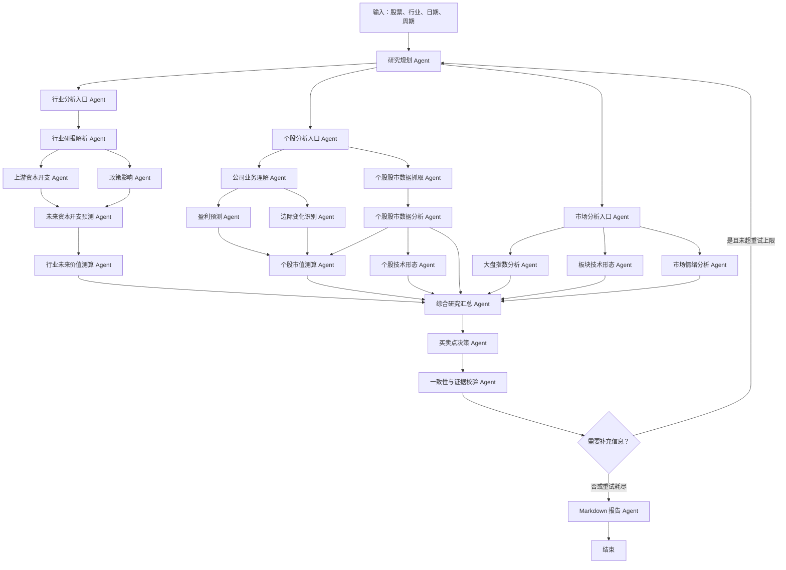

# 基于示意图重构的 LangGraph 股票研究 Agent 实施计划

## 1. 建设目标

本目录是独立实现，不依赖仓库中既有 Agent 编排。输入股票代码、行业、分析日期和投资周期后，系统并行执行行业、个股、市场三条研究链路，经综合决策与 Reflection 校验，最终生成 Markdown 研究报告。系统只输出研究辅助结论，不执行交易指令。

## 2. 流水线设计

LangGraph 使用 `add_edge([前驱列表], 汇合节点)` 实现真正的等待式汇合，避免某一并行分支先完成就提前触发综合分析。Reflection 的条件边只在 `needs_retry=true` 且没有达到 `max_retries` 时回到 Planner。

## 3. Agent 文件与职责

所有节点位于 `agents/`，每个不同节点单独一个文件。

| Agent 文件 | 输入重点 | 输出 State 字段 |
| --- | --- | --- |
| `planner_agent.py` | 标的、行业、周期、补采任务 | `planner_tasks` |
| `industry_entry_agent.py` | 行业参数 | `industry_task_context` |
| `industry_report_agent.py` | 行业研报与证据 | `industry_report_result` |
| `upstream_capex_agent.py` | 上游资本开支记录 | `upstream_capex_result` |
| `policy_agent.py` | 政策、监管、补贴、大事件 | `policy_result` |
| `future_capex_forecast_agent.py` | 需求/供应侧资本开支、政策量化影响 | `future_capex_forecast_result` |
| `industry_valuation_agent.py` | 行业利润/收入与估值假设 | `industry_valuation_result` |
| `stock_entry_agent.py` | 个股参数 | `stock_task_context` |
| `stock_data_fetch_agent.py` | 股票、基准、行业指数代码 | `stock_market_data` |
| `stock_data_analysis_agent.py` | OHLCV 与估值历史 | `stock_market_data_analysis` |
| `business_agent.py` | 主营、收入结构、行业映射 | `business_result` |
| `profit_forecast_agent.py` | 收入、利润、EPS、一致预期 | `profit_forecast_result` |
| `marginal_change_agent.py` | 订单、认证、产能、新产品 | `marginal_change_result` |
| `company_valuation_agent.py` | 盈利预测、PE、当前市值 | `company_valuation_result` |
| `stock_technical_agent.py` | 均线、量价、区间高低点 | `stock_technical_result` |
| `market_entry_agent.py` | 市场参数 | `market_task_context` |
| `index_analysis_agent.py` | 大盘指数行情 | `index_analysis_result` |
| `sector_technical_agent.py` | 行业指数行情 | `sector_technical_result` |
| `sentiment_agent.py` | 新闻、研报、社媒辅助证据 | `sentiment_result` |
| `research_join_agent.py` | 三路全部结果 | `joined_research_result` |
| `decision_agent.py` | 汇总结果与硬性约束 | `decision_result` |
| `review_agent.py` | 完整度、证据、逻辑、覆盖率 | `review_result` |
| `report_agent.py` | 全量 State | `final_markdown` |

## 4. 个股股市数据分析

`analysis/market_metrics.py` 使用纯函数完成指标计算，方便独立测试和替换数据源。

- 区间收益：5、20、60、120、250 日复权收益。
- 趋势结构：最新复权收盘价相对 MA20、MA60、MA120、MA250 的位置与距离。
- 波动风险：20 日年化波动率、完整窗口最大回撤、ATR14 绝对值和比例。
- 量价关系：近 5 日均量与此前 20 日均量比较，识别放量上涨、放量下跌、缩量反弹和成交萎缩。
- 估值位置：PE TTM、PB、PS TTM 的当前值、样本数和历史百分位。
- 异常事件：3% 跳空、7% 单日涨跌、2.5 倍异常成交量、关键均线突破或跌破。
- 相对强弱：对大盘和行业指数计算 20、60、120、250 日超额收益。
- 数据覆盖：明确记录行情条数、估值条数、覆盖率、数据源和缺失项。

## 5. 决策与风控规则

- 行业趋势向上、盈利预测上修、正向边际变化、股价均线结构向上分别增加评分。
- 行业趋势向下、盈利预测下修、负向边际变化、股价均线结构向下分别降低评分。
- PE 历史分位不低于 80%、情绪拥挤、价格偏离 MA20 超过 15% 时降低追买倾向。
- 大盘 `risk_off` 时对个股正面信号折价。
- 高估值、情绪拥挤或技术高位与买入信号冲突时，将 `buy` 降为 `hold`。
- 行情覆盖低于 80%、存在关键缺失项或可追溯证据少于 3 条时，不允许输出高置信度 `buy` 或 `sell`。
- 所有结果附带支撑理由、冲突点、风险和失效条件，不把单一技术指标直接解释为买卖依据。

## 6. 数据与依赖边界

- `MarketDataProvider`：负责股票和指数行情，当前提供离线内存实现与可选 `yfinance` 实现。
- `ResearchDataProvider`：使用 Pydantic v2 的 `SourceRequest`、`SourceBatch`、`MetricFact`、`EvidenceItem` 和 `CoverageReport`。默认组合旧 mock 输入与授权文件；SEC、ECB、官方政策网页、Tushare、巨潮及 Wind/iFinD 均为可插拔适配器。
- 海外需求侧固定为 Alphabet、Amazon、Microsoft、Meta、Oracle；NVIDIA 单列为供应侧，不进入需求侧 CapEx 总和。
- 网络适配器统一采用超时、有限重试、限速、进程内缓存和 `as_of_date` 截断；凭据只从环境变量读取。
- `AnalysisRepository`：负责节点审计和最终报告持久化，默认使用无副作用实现，生产环境可接 PostgreSQL。
- Agent 只依赖协议，不直接访问数据库或第三方 API；更换数据源不会改变图结构。

## 7. 数据库设计原则

- PostgreSQL 作为生产数据库，JSONB 只保存不稳定结构；标的、日期、收益、估值等高频查询字段保持列式结构。
- `analysis_runs` 是一次研究的主实体，所有分析结果通过 `run_id` 关联。
- `source_documents -> evidence_items -> decision_evidence_links -> decision_records` 形成证据追溯链。
- `node_runs -> decision_node_links -> decision_records` 形成执行追溯链。
- `decision_records.stock_market_analysis_id` 强制每条最终决策关联一份个股市场数据分析。
- 行情和估值原始数据按股票、日期、数据源设置唯一约束，避免重复入库。

完整 DDL 见 `database/schema.sql`，ER 图见 `database/relationships.md`。

## 8. Markdown 报告结构

1. 结论摘要
2. 行业分析
3. 上游资本开支与政策影响
4. 未来资本开支预测与行业价值测算
5. 公司业务与行业增长匹配度
6. 盈利预测与估值测算
7. 边际变化分析
8. 个股股市数据分析
9. 个股技术形态分析
10. 大盘与板块环境
11. 市场情绪分析
12. 综合买卖点判断
13. 主要风险与失效条件
14. 证据引用与数据缺口
15. Reflection 校验结果

## 9. 测试与验收

- 指标单测覆盖收益、均线、波动率、回撤、ATR、量价、估值分位和相对收益。
- 决策测试覆盖强势但高估值、正向边际变化但技术高位、弱大盘下的降级处理。
- Review 测试覆盖缺失数据回 Planner、达到最大重试后继续输出低置信度报告。
- 图结构测试确认三个入口并行、两个多前驱汇合点、Reflection 条件回路和最终 END。
- 数据库验收确认决策可追溯到 `stock_market_analysis`、`evidence_items` 和 `node_runs`。

## 10. 实施顺序

1. 安装依赖并运行离线测试。
2. 接入真实行情 Provider，确认股票和指数代码映射。
3. 接入研报、政策、公告和情绪数据采集器，统一输出证据结构。
4. 实现 PostgreSQL Repository，把节点输入输出和最终报告落库。
5. 配置 LangGraph checkpointer，实现中断恢复与人工复核。
6. 使用历史样本回放决策规则，校准阈值后再用于研究环境。

## 11. 默认假设

- 输入至少包含 `ticker` 和 `industry_name`；历史窗口默认五年，预测未来两年，基准币种为 CNY。
- 默认日线窗口覆盖约 550 个自然日，以获得不少于 250 个交易日。
- 默认大盘代码为 `000300.SS`；行业指数代码必须由调用方提供。
- 新闻和社媒情绪只作为辅助证据，不能单独触发买卖结论。
- 输出不构成投资建议，不包含自动下单能力。
