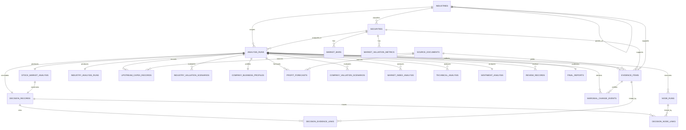

# 数据库关系图

实线表示数据库外键；`decision_evidence_links` 和 `decision_node_links` 保证每条决策都能追溯到证据和节点执行记录。

```mermaid
erDiagram
    INDUSTRIES ||--o{ INDUSTRIES : parent_of
    INDUSTRIES ||--o{ SECURITIES : classifies
    INDUSTRIES ||--o{ ANALYSIS_RUNS : scopes
    SECURITIES ||--o{ ANALYSIS_RUNS : analyzed_in
    SECURITIES ||--o{ MARKET_BARS : has
    SECURITIES ||--o{ MARKET_VALUATION_METRICS : has

    SOURCE_DOCUMENTS ||--o{ EVIDENCE_ITEMS : yields
    ANALYSIS_RUNS ||--o{ EVIDENCE_ITEMS : collects
    SECURITIES ||--o{ EVIDENCE_ITEMS : supports
    INDUSTRIES ||--o{ EVIDENCE_ITEMS : supports

    ANALYSIS_RUNS ||--o{ NODE_RUNS : executes
    ANALYSIS_RUNS ||--|| STOCK_MARKET_ANALYSIS : produces
    ANALYSIS_RUNS ||--|| INDUSTRY_ANALYSIS_RUNS : produces
    ANALYSIS_RUNS ||--o{ UPSTREAM_CAPEX_RECORDS : records
    ANALYSIS_RUNS ||--o{ INDUSTRY_VALUATION_SCENARIOS : evaluates
    ANALYSIS_RUNS ||--|| COMPANY_BUSINESS_PROFILES : profiles
    ANALYSIS_RUNS ||--o{ PROFIT_FORECASTS : forecasts
    ANALYSIS_RUNS ||--o{ MARGINAL_CHANGE_EVENTS : detects
    ANALYSIS_RUNS ||--o{ COMPANY_VALUATION_SCENARIOS : evaluates
    ANALYSIS_RUNS ||--o{ MARKET_INDEX_ANALYSIS : analyzes
    ANALYSIS_RUNS ||--o{ TECHNICAL_ANALYSIS : analyzes
    ANALYSIS_RUNS ||--|| SENTIMENT_ANALYSIS : analyzes

    SOURCE_DOCUMENTS ||--o{ UPSTREAM_CAPEX_RECORDS : sources
    SOURCE_DOCUMENTS ||--o{ PROFIT_FORECASTS : sources
    EVIDENCE_ITEMS ||--o{ MARGINAL_CHANGE_EVENTS : verifies

    ANALYSIS_RUNS ||--|| DECISION_RECORDS : concludes
    STOCK_MARKET_ANALYSIS ||--|| DECISION_RECORDS : constrains
    DECISION_RECORDS ||--o{ DECISION_EVIDENCE_LINKS : cites
    EVIDENCE_ITEMS ||--o{ DECISION_EVIDENCE_LINKS : linked_by
    DECISION_RECORDS ||--o{ DECISION_NODE_LINKS : traces
    NODE_RUNS ||--o{ DECISION_NODE_LINKS : linked_by
    ANALYSIS_RUNS ||--o{ REVIEW_RECORDS : reviews
    ANALYSIS_RUNS ||--|| FINAL_REPORTS : publishes
```
