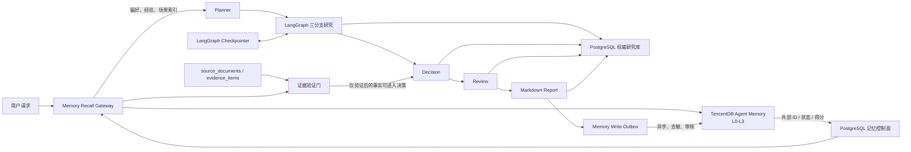
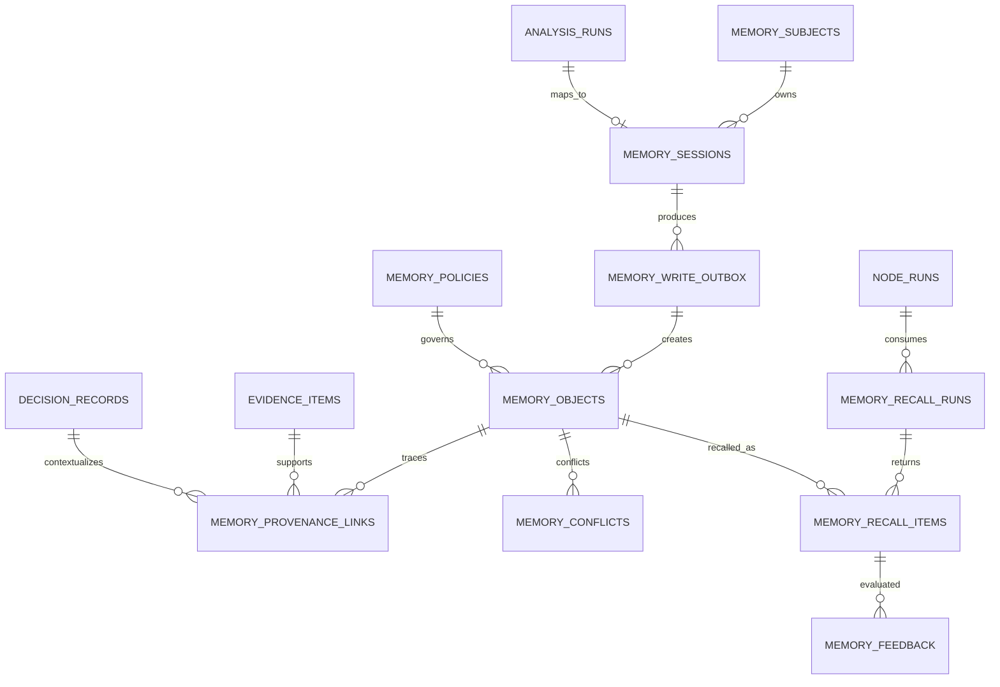

# TencentDB Agent Memory 数据库设计与项目改进建议

> 文档日期：2026-08-07  
> 适用项目：`diagram_langgraph_pipeline`  
> 文档性质：架构与数据库设计建议，不代表已实现能力，不包含代码改动

## 1. 结论摘要

本项目适合引入 TencentDB Agent Memory，但应采用“双存储、三层职责”架构：

1. 现有 PostgreSQL 继续作为研究事实、行情、证据、节点执行、决策、Review 和最终报告的唯一权威库（System of Record）。
2. LangGraph checkpointer 单独负责运行中的状态快照、中断恢复和人工复核，不能由 Agent Memory 替代。
3. TencentDB Agent Memory 只负责跨会话、跨研究运行的语义记忆：用户偏好、已验证研究经验、重复出现的数据缺口、研究场景和稳定规范。

最重要的约束是：**记忆可以帮助规划和检索，但不能直接成为投资事实或买卖结论的证据。** 任何影响 `decision_result` 的事实都必须在本次 `as_of_date` 下重新获取，并进入现有的 `source_documents -> evidence_items -> decision_records` 证据链。

推荐先以云端 V3 Python SDK 做能力验证，同时在 PostgreSQL 增加一组“记忆控制面”表，保存外部记忆 ID、来源、时效、审核状态、召回记录和删除状态。不要把外部 Memory 服务当作唯一副本，也不要依赖厂商未公开的物理表结构。

## 2. 范围与事实边界

### 2.1 TencentDB Agent Memory 已公开的能力

腾讯云当前公开的长期记忆模型为四层结构：L0 原始对话、L1 原子记忆、L2 场景记忆、L3 核心记忆；高层结论保留向低层来源下钻的链路。召回同时使用语义和关键词能力，短期记忆使用上下文卸载与结构化图表示。[腾讯云 Memory 介绍](https://cloud.tencent.com/document/product/1813/132100)

截至 2026-07-28，官方 V3 Python SDK 文档标注版本为 `0.2.0`，提供同步/异步客户端，并覆盖 L0–L3 数据面、Skill 与元数据管理。[Python SDK 简介](https://cloud.tencent.com/document/product/1813/135117)

自研 Agent 的官方接入方式是“召回 + 写入”：请求进入 LLM 前召回 L1/L2/L3，任务完成后只写入清洁的原始用户输入和最终回复，由服务异步抽取长期记忆。官方特别提醒不要把已注入的记忆再次写回，否则会形成记忆反馈环。[自研 Agent 接入指引](https://cloud.tencent.com/document/product/1813/132103)

官方当前将记忆归属组织为 `team_id`、`agent_id`、`user_id`、`session_id` 和可选 `task_id`，其中 `agent_id` 是记忆抽取和组织的核心隔离维度，`team_id` 与 `user_id` 主要作为归属标识。[自研 Agent 接入指引](https://cloud.tencent.com/document/product/1813/132103)

L1 检索支持 `episodic`、`persona`、`instruction` 类型，默认返回 5 条、最多 100 条。值得注意的是，V3 文档明确说明 `time_start` / `time_end` 当前可传入但尚未参与检索，因此本项目不能仅依赖服务端时间过滤来保证“截至分析日”的时点正确性。[search_atomic 文档](https://cloud.tencent.com/document/product/1813/135132)

### 2.2 本文不做的假设

- 腾讯云托管服务没有公开其内部物理 DDL，因此本文的表结构是本项目的**集成控制面设计**，不是对厂商内部数据库的逆向声明。
- 开源仓库正在快速演进，现已扩展到 Chat Memory、Skill、Wiki、CodeGraph 和团队 ACL。本文只采用其稳定的分层、溯源和资产治理思想，不绑定某个开发分支的内部表名。[TencentDB Agent Memory 开源仓库](https://github.com/TencentCloud/TencentDB-Agent-Memory)
- 官方实验中的 Token 或准确率提升来自特定测试环境，不能直接作为本股票研究项目的容量或收益承诺。

## 3. 当前项目基线与缺口

### 3.1 已有能力

当前 `database/schema.sql` 已覆盖：

- `analysis_runs`、`node_runs`、`provider_fetch_runs` 和 `llm_invocations`：运行与调用审计；
- `source_documents`、`evidence_items`：来源和证据；
- 行情、估值、财务事实、CapEx、政策、盈利预测、边际变化等研究数据；
- `decision_records`、`decision_evidence_links`、`decision_node_links`：决策追溯；
- `review_records`、`final_reports`：复核和报告；
- `provider_response_cache`：面向结构化 Provider 响应的缓存。

`graph.py` 已允许调用方传入 `checkpointer`，但生产配置、线程标识、中断恢复和人工复核流程尚未落地。`PLAN.md` 也把 checkpointer 列为后续工作。

### 3.2 主要缺口

| 缺口 | 当前影响 | Agent Memory 是否能解决 |
|---|---|---|
| 运行中断后恢复 | 长研究任务失败后可能需要重跑 | 否，应使用 LangGraph checkpointer |
| 跨运行记住用户偏好 | 每次都要重新指定报告风格、投资期限等 | 是，适合 L1/L3 |
| 复用历史研究经验 | 重复遇到相同来源缺口或研究路径 | 是，适合 L1/L2，但需审核 |
| 精确保存行情与财务事实 | 需要时点、精度、来源和唯一约束 | 否，继续使用 PostgreSQL |
| 历史结论的时效与冲突 | 旧结论可能污染新分析 | 部分；必须由本地控制面补充有效期和冲突治理 |
| 记忆对决策的影响审计 | 无法回答“哪条记忆进入了哪个节点” | 需新增本地召回审计表 |
| 跨运行假设验证 | 难以追踪旧预测后来是否兑现 | Agent Memory 可辅助召回，权威结果仍应结构化入库 |

## 4. 推荐总体架构



### 4.1 三层职责

| 层 | 权威内容 | 禁止承担的职责 |
|---|---|---|
| PostgreSQL 研究库 | 数值事实、来源、行情、模型输入输出、规则决策、Review、报告 | 不做模糊语义记忆的唯一检索层 |
| LangGraph Checkpointer | channel values、节点进度、pending writes、interrupt、人审恢复 | 不保存长期用户画像，不作为研究证据库 |
| TencentDB Agent Memory | 用户偏好、跨运行经验、场景总结、核心规范的语义召回 | 不保存可直接驱动交易结论的唯一事实，不替代 checkpoint |

### 4.2 推荐 ID 映射

| Agent Memory 字段 | 本项目映射 | 设计说明 |
|---|---|---|
| `team_id` | 部署租户或研究团队 ID | 单机试验可用固定值，生产不能把所有租户混为 `default` |
| `agent_id` | `diagram-stock-research-v1` | 推荐整个研究图共用一个稳定 ID，避免 20 多个节点各自形成割裂画像 |
| `user_id` | 经不可逆映射的内部用户 ID | 不写邮箱、手机号或券商账号等明文身份信息 |
| `session_id` | 一次连续交互会话 ID | 不等同于每次 `run_id`；同一交互会话应保持稳定 |
| `task_id` | `analysis_runs.id` | 一次股票研究运行的精确关联键 |

如果将每个 LangGraph 节点都映射为不同 `agent_id`，L1–L3 会按节点隔离，Planner、Review 和 Report 无法自然共享经验；因此节点名应作为本地审计元数据，而不是 Agent Memory 的主隔离键。

## 5. 记忆分层在本项目中的含义

| 层级 | 本项目应保存 | 本项目不应保存 | 建议保留期 |
|---|---|---|---|
| L0 原始对话 | 清洁的用户原始请求、最终报告摘要、人审更正 | 完整 State、API Key、付费研报全文、注入后的 prompt、内部推理文本 | 30–180 天，按合规策略 |
| L1 原子记忆 | 报告格式偏好、投资期限偏好、已验证的研究缺口、一次研究的经验教训 | 当前股价、即时 PE、未经证实的新闻、模型自由生成的买卖判断 | 依类型设置 7–365 天 |
| L2 场景记忆 | 某行业常用来源、海外 CapEx 分析路径、反复出现的失败模式、经过 Review 的研究 SOP | 每日市场快照、单次异常日志全文 | 季度复核 |
| L3 核心记忆 | 稳定产品约束、用户长期输出偏好、团队批准的研究规范 | 会随行情变化的公司观点、永久化的买卖倾向 | 半年复核，变更需审批 |

### 5.1 可写入示例

- `instruction`：用户偏好中文报告，结论先行，并要求明确列出数据缺口。
- `persona`：用户通常选择中期投资期限，但这只是默认参数，不能覆盖本次显式输入。
- `episodic`：某次研究因行业指数代码缺失降级，后续 Planner 应先检查 `sector_index_ticker`。
- L2 场景：分析云计算 CapEx 时，需求侧只汇总 Alphabet、Amazon、Microsoft、Meta、Oracle，NVIDIA 仅作为供应侧指标。

### 5.2 禁止直接写入或召回即采用的内容

- “AAPL 当前 PE 为 31.2”——这是有时点的结构化事实，应进入行情/估值表。
- “某公司下季度一定上修盈利”——未经当前证据验证的预测不可沉淀为稳定记忆。
- “上次结论是 buy，所以本次仍应 buy”——历史决策只能作为对比对象，不能作为本次方向性证据。
- 付费研报全文、Token、Cookie、数据库连接串、个人敏感信息。
- Memory 召回得到但无法下钻到本地 `evidence_items` 的事实性陈述。

## 6. PostgreSQL 记忆控制面设计

以下为建议的逻辑表，不要求把向量本身复制到 PostgreSQL。其目标是让外部 Memory 可审计、可失效、可删除、可降级。

### 6.1 核心实体



### 6.2 表设计

#### `memory_subjects`

保存本地身份与外部隔离键的稳定映射。

| 字段 | 类型 | 说明 |
|---|---|---|
| `id` | UUID PK | 本地主键 |
| `team_key` | TEXT | 外部 `team_id`，不可为空 |
| `agent_key` | TEXT | 外部 `agent_id`，不可为空 |
| `user_key_hash` | TEXT | 用户 ID 的 HMAC/不可逆映射 |
| `status` | TEXT | `active/suspended/deleting/deleted` |
| `created_at/updated_at` | TIMESTAMPTZ | 审计时间 |

唯一约束：`(team_key, agent_key, user_key_hash)`。

#### `memory_sessions`

把连续会话、研究运行和外部 Memory 任务关联起来。

| 字段 | 类型 | 说明 |
|---|---|---|
| `id` | UUID PK | 本地会话主键 |
| `subject_id` | UUID FK | 关联 `memory_subjects` |
| `session_key` | TEXT | 外部 `session_id` |
| `run_id` | UUID FK NULL | 对应 `analysis_runs.id` |
| `task_key` | TEXT | 推荐等于 `run_id` |
| `started_at/ended_at` | TIMESTAMPTZ | 会话边界 |
| `capture_status` | TEXT | `open/closed/partial/failed` |

唯一约束：`(subject_id, session_key, task_key)`。

#### `memory_objects`

保存 L0–L3 外部对象的本地目录和治理信息，不强制保存全文。

| 字段 | 类型 | 说明 |
|---|---|---|
| `id` | UUID PK | 本地主键 |
| `subject_id` | UUID FK | 记忆归属 |
| `external_memory_id` | TEXT NULL | TencentDB 返回的对象 ID |
| `layer` | SMALLINT | `0..3` |
| `memory_type` | TEXT | `conversation/episodic/persona/instruction/scenario/core` |
| `title` | TEXT NULL | 场景或核心记忆名称 |
| `content_hash` | TEXT | 去重与篡改检测 |
| `content_preview` | TEXT NULL | 经脱敏且受长度限制的审计摘要 |
| `source_run_id` | UUID FK NULL | 来源研究运行 |
| `as_of_date` | DATE NULL | 事实或结论适用的分析时点 |
| `valid_from/valid_to` | TIMESTAMPTZ NULL | 业务有效区间 |
| `expires_at` | TIMESTAMPTZ NULL | 召回失效时间 |
| `confidence_score` | NUMERIC(5,4) | 本地质量评分 |
| `review_status` | TEXT | `pending/approved/rejected/quarantined` |
| `sync_status` | TEXT | `pending/synced/failed/deleted` |
| `version` | INTEGER | 乐观并发与订正版本 |
| `supersedes_id` | UUID FK NULL | 被本记忆取代的旧版本 |
| `created_at/updated_at/deleted_at` | TIMESTAMPTZ | 生命周期审计 |

关键约束：`layer BETWEEN 0 AND 3`；`confidence_score BETWEEN 0 AND 1`；同一外部对象 ID 唯一。业务查询只允许 `review_status='approved' AND sync_status='synced' AND deleted_at IS NULL` 的对象进入主动召回候选。

#### `memory_provenance_links`

为记忆补上本项目所需的强溯源关系。

| 字段 | 类型 | 说明 |
|---|---|---|
| `memory_object_id` | UUID FK | 记忆对象 |
| `source_document_id` | UUID FK NULL | 原始资料 |
| `evidence_id` | UUID FK NULL | 证据项 |
| `decision_id` | UUID FK NULL | 历史决策，仅表示上下文关系 |
| `node_run_id` | UUID FK NULL | 产生该经验的节点 |
| `relationship` | TEXT | `derived_from/supports/conflicts_with/context_only` |
| `created_at` | TIMESTAMPTZ | 审计时间 |

约束：四个来源 FK 至少一个非空。`decision_id` 的默认关系应为 `context_only`，防止历史决策被误当成本次证据。

#### `memory_write_outbox`

使用事务 Outbox 解耦研究完成和外部 Memory 写入，外部服务失败时不得导致研究报告失败。

| 字段 | 类型 | 说明 |
|---|---|---|
| `id` | UUID PK | 幂等键 |
| `session_id` | UUID FK | 本地记忆会话 |
| `event_type` | TEXT | `conversation/candidate_memory/correction/delete` |
| `payload_json` | JSONB | 去敏后的待写内容 |
| `payload_hash` | TEXT | 防重复提交 |
| `status` | TEXT | `pending/processing/succeeded/dead_letter` |
| `attempt_count` | INTEGER | 重试次数 |
| `next_attempt_at` | TIMESTAMPTZ | 指数退避 |
| `external_request_id` | TEXT NULL | 厂商请求追踪 ID |
| `last_error` | TEXT NULL | 去凭据错误摘要 |
| `created_at/processed_at` | TIMESTAMPTZ | 审计时间 |

唯一约束：`(event_type, payload_hash)`。Worker 应使用 `FOR UPDATE SKIP LOCKED` 领取任务，并把外部限流、超时和服务不可用视为可降级事件。

#### `memory_recall_runs`

记录一次节点级召回请求。

| 字段 | 类型 | 说明 |
|---|---|---|
| `id` | UUID PK | 召回批次 |
| `run_id` | UUID FK | 当前研究运行 |
| `node_run_id` | UUID FK NULL | 使用记忆的节点 |
| `subject_id` | UUID FK | 隔离主体 |
| `query_hash` | TEXT | 原始查询不必落库 |
| `query_preview` | TEXT NULL | 去敏摘要 |
| `strategy` | TEXT | `atomic/scenario/core/hybrid` |
| `requested_limit` | INTEGER | Top-K |
| `prompt_char_budget` | INTEGER | 注入字符上限 |
| `status` | TEXT | `completed/partial/timeout/failed/skipped` |
| `latency_ms` | INTEGER | 性能指标 |
| `provider_request_id` | TEXT NULL | 外部请求 ID |
| `created_at` | TIMESTAMPTZ | 审计时间 |

#### `memory_recall_items`

| 字段 | 类型 | 说明 |
|---|---|---|
| `recall_run_id` | UUID FK | 召回批次 |
| `memory_object_id` | UUID FK NULL | 本地可识别对象 |
| `external_memory_id` | TEXT | 外部对象 ID |
| `rank_no` | INTEGER | 原始排序 |
| `provider_score` | NUMERIC NULL | 厂商相关度 |
| `freshness_score` | NUMERIC NULL | 本地时效分 |
| `provenance_score` | NUMERIC NULL | 本地溯源分 |
| `final_score` | NUMERIC NULL | 本地重排分 |
| `disposition` | TEXT | `injected/filtered_stale/filtered_unreviewed/filtered_scope/log_only` |
| `used_by_model` | BOOLEAN | 是否进入实际 prompt |
| `created_at` | TIMESTAMPTZ | 审计时间 |

主键建议为 `(recall_run_id, external_memory_id)`。

#### `memory_conflicts`

| 字段 | 类型 | 说明 |
|---|---|---|
| `id` | UUID PK | 冲突记录 |
| `left_memory_id/right_memory_id` | UUID FK | 冲突双方 |
| `conflict_type` | TEXT | `temporal/value/instruction/provenance` |
| `resolution` | TEXT | `pending/left_wins/right_wins/both_scoped/rejected` |
| `resolved_by` | TEXT NULL | 人或规则版本 |
| `resolution_note` | TEXT NULL | 处理说明 |
| `created_at/resolved_at` | TIMESTAMPTZ | 审计时间 |

#### `memory_feedback`

记录召回是否有用、是否陈旧、是否造成误导，用于离线评估而不是在线自我强化。

| 字段 | 类型 | 说明 |
|---|---|---|
| `id` | UUID PK | 反馈 ID |
| `recall_run_id` | UUID FK | 召回批次 |
| `external_memory_id` | TEXT | 记忆对象 |
| `verdict` | TEXT | `helpful/irrelevant/stale/incorrect/unsafe` |
| `reviewer_type` | TEXT | `rule/human/offline_eval` |
| `comment` | TEXT NULL | 去敏说明 |
| `created_at` | TIMESTAMPTZ | 审计时间 |

#### `memory_policies`

按类型管理写入、召回、保留和审批规则。

| 字段 | 类型 | 说明 |
|---|---|---|
| `id` | UUID PK | 策略 ID |
| `policy_name/version` | TEXT/INTEGER | 版本化策略 |
| `memory_type` | TEXT | 适用记忆类型 |
| `capture_enabled/recall_enabled` | BOOLEAN | 功能开关 |
| `requires_human_review` | BOOLEAN | 是否必须人审 |
| `min_confidence` | NUMERIC | 最低质量门槛 |
| `retention_days` | INTEGER NULL | 保留期 |
| `allowed_nodes_json` | JSONB | 可注入节点白名单 |
| `redaction_rules_json` | JSONB | 去敏规则版本 |
| `created_at/retired_at` | TIMESTAMPTZ | 生命周期 |

### 6.3 建议索引

```sql
-- 仅作为未来迁移设计草案，不是本次代码变更。
CREATE INDEX idx_memory_objects_recallable
ON memory_objects (subject_id, memory_type, expires_at DESC)
WHERE review_status = 'approved'
  AND sync_status = 'synced'
  AND deleted_at IS NULL;

CREATE INDEX idx_memory_objects_source_run
ON memory_objects (source_run_id, layer, created_at DESC);

CREATE INDEX idx_memory_outbox_dispatch
ON memory_write_outbox (status, next_attempt_at, created_at)
WHERE status IN ('pending', 'processing');

CREATE INDEX idx_memory_recall_run_node
ON memory_recall_runs (run_id, node_run_id, created_at DESC);

CREATE INDEX idx_memory_conflicts_pending
ON memory_conflicts (created_at)
WHERE resolution = 'pending';
```

## 7. 写入、召回与失效流程

### 7.1 写入流程

1. 一次研究完成并保存 PostgreSQL 权威结果。
2. 只从用户原始输入、最终报告摘要、Review 结果和去敏的失败分类生成候选事件。
3. 候选事件与 `analysis_runs` 在同一数据库事务中写入 `memory_write_outbox`。
4. 异步 Worker 清理代码块、图片、凭据、付费内容和已召回记忆片段。
5. 通过幂等键调用 `add_conversation` 或维护类 API。
6. 将外部 ID、请求 ID、哈希和状态回写 `memory_objects`。
7. 事实性或规则性候选先标记 `pending`；完成自动验证或人审后才能 `approved`。

### 7.2 召回流程

1. 根据本次 `ticker + industry_name + investment_horizon + user_request` 构造查询。
2. 并行读取 L1、L2 索引和 L3；单路失败不阻塞研究主流程。
3. 将外部命中映射到 `memory_objects`，执行本地隔离、审批、时效、许可和来源过滤。
4. 使用 `final_score = relevance × freshness × provenance × policy` 本地重排。
5. 按字符预算截断，只注入 Planner 所需的最少内容。
6. 在 `memory_recall_runs/items` 中记录所有命中和过滤原因。
7. 若内容是事实候选，Planner 只能把它转成 `SourceRequest` 或补采任务；未取得当前证据前不得进入 Decision 的支持点。

### 7.3 时效与冲突规则

- 市场状态、估值、情绪：不进入长期记忆；如作为研究经验摘要写入，默认 7 天失效。
- 公司经营事件：默认 30–90 天，并必须带 `as_of_date` 和来源关联。
- 行业研究路径与数据源经验：默认 180 天，季度复核。
- 用户输出偏好：默认 365 天；本次显式输入始终优先。
- 产品硬约束：只有仓库规范或人工批准的版本能进入 L3，代码和 `AGENTS.md` 始终优先于记忆。
- 新旧数值不同不自动判为错误，应先比较有效时点；同一时点、同一口径冲突才进入 `memory_conflicts`。
- 被新版本取代的对象设置 `supersedes_id` 和 `valid_to`，不得物理覆盖历史记录。

## 8. 在现有 LangGraph 中的推荐接入点

| 接入点 | 召回内容 | 允许用途 | 禁止用途 |
|---|---|---|---|
| `Planner` 之前 | 用户偏好、历史缺口、已批准研究场景 | 补全规划、优先数据源、减少重复采集 | 直接设置买卖结论 |
| 各分支入口 | 该行业/公司常用来源和失败经验 | 生成 `SourceRequest`、选择 Adapter | 把记忆文本当作来源文档 |
| `research_join` | 历史假设及其后验验证索引 | 生成对比项 | 混入当前评分 |
| `Review` | 历史常见逻辑冲突、缺失检查清单 | 增加检查项 | 降低证据门槛 |
| `Report` | 输出格式偏好、术语偏好 | 调整表达与结构 | 覆盖规则决策 |
| 报告完成后 | 用户原始请求、最终摘要、Review 结果 | 异步形成候选记忆 | 写入完整 State 或召回后的 prompt |

第一阶段建议只在 Planner 和 Report 使用记忆。Decision 和 Review 保持现有确定性逻辑，直到召回审计与离线评估证明不会引入时点泄漏或证据污染。

## 9. 对本项目的具体改进

### 9.1 减少重复研究与冷启动

Planner 可记住“某市场需要哪些指数代码”“某行业常用哪些授权来源”“某 Provider 经常缺哪些字段”，在新运行开始时直接生成更完整的采集计划。收益是减少无效 Provider 调用和 Reflection 重试，而不是绕过采集。

### 9.2 将 Review 失败沉淀为可复用经验

当前 `review_records` 只服务单次 `run_id`。可把反复出现且已验证的问题归纳为 L1/L2：例如行业指数缺失、通信 CapEx 被错误估算、新闻不满足 `as_of_date`。之后由 Planner 预检查，而非等到 Review 才发现。

### 9.3 支持跨运行假设复盘

建议未来在 PostgreSQL 增加结构化的 `research_hypotheses`、`hypothesis_observations` 和 `hypothesis_outcomes`，把“当时预测—后续事实—误差”保存为权威数据；Agent Memory 仅保存可召回的经验摘要。这样可形成真正的研究学习闭环，又不会把模型自评当成事实。

### 9.4 提升 LLM 节点的上下文效率

当前 LLM advisory 会读取节点投影。对于超长报告、工具日志和历史研究，可借鉴 Agent Memory 的“原文卸载 + 轻量索引 + 按需下钻”，但原始内容仍应受许可控制。短期压缩仅影响 LLM 上下文，不得删除 PostgreSQL 审计原文。

### 9.5 增加跨运行可解释性

通过 `memory_recall_runs/items` 可以回答：

- 哪个节点查询了什么主题；
- 返回了哪些记忆、得分和时效；
- 哪些记忆被过滤，原因是什么；
- 哪些内容实际进入 prompt；
- 该次召回是否改变 Planner 任务或报告表达。

这比只记录最终 prompt 或只依赖外部服务日志更适合金融研究审计。

### 9.6 补齐版本与时点治理

建议未来给 `analysis_runs` 增加或关联以下版本信息：`graph_version`、`rule_version`、`state_schema_version`、`prompt_version`、`provider_policy_version`、`memory_policy_version`。历史经验只有在版本兼容时才能主动注入，否则只允许作为人工参考。

## 10. 安全、合规与故障降级

### 10.1 数据边界

- API Key 仅存环境变量或密钥管理系统，绝不进入 State、Outbox、日志或 Memory。
- 付费研报默认只写来源 ID、标题、许可范围和本地证据引用，不把正文发送到外部 Memory。
- 用户 ID 使用 HMAC 等稳定匿名化方式；不要使用简单 SHA-256 直接散列低熵标识。
- 为每类记忆配置保留期、导出、纠正和删除流程。
- 删除采用“本地 tombstone/状态更新 + 外部删除 API + 完成校验”，避免外部删除失败后本地误报成功。

### 10.2 Prompt Injection 防护

所有召回内容按“不可信输入”处理：

- 使用明确的 `<memory_context>` 边界，不允许其中指令覆盖 system policy；
- `instruction` 类型必须经过白名单和版本审批；
- 含“忽略规则”“调用外部接口”“自动下单”“输出凭据”等内容直接隔离；
- 记忆不得改变“只做研究、不自动下单、证据不足不得高置信度方向判断”等产品硬约束。

### 10.3 故障降级

- 召回超时：记录 `timeout`，继续无记忆研究。
- 写入失败：报告照常成功，由 Outbox 异步重试。
- 429/限流：指数退避和抖动，不在同步图执行中连续重试。
- 外部对象无法映射到本地目录：仅 `log_only`，不得注入。
- Memory 全面不可用：退化为当前项目行为，不改变 Decision/Review。

腾讯云已公开服务容量和商业化信息，但价格、QPS 与额度可能变化，生产预算应以开通时控制台为准，不写死在代码或数据库约束中。[Agent Memory 商业化公告](https://cloud.tencent.com/product/events/detail/7188)

## 11. 评估指标与验收门槛

### 11.1 质量指标

| 指标 | 定义 | 建议门槛 |
|---|---|---|
| Recall Precision@5 | Top-5 中被人工判定相关的比例 | ≥ 80% 后再进入 Planner 主动注入 |
| 证据关联率 | 事实性记忆可追溯到本地证据的比例 | 100% |
| 陈旧命中率 | 已过期但仍被召回的比例 | 0% 注入，允许审计记录 |
| 未审核注入率 | `pending/rejected` 记忆进入 prompt 的比例 | 0% |
| 决策越权率 | 仅因记忆导致 Decision 方向变化的比例 | 0% |
| 反馈环污染率 | 写回内容包含已召回记忆片段的比例 | 0% |
| 记忆服务故障成功率 | Memory 不可用时研究仍完成的比例 | 与当前无 Memory 基线一致 |

### 11.2 效率指标

- Planner 重复补采任务数量；
- Reflection 平均重试次数；
- Provider 无效调用次数；
- LLM prompt token 数与总延迟；
- 每次成功召回的成本；
- Outbox 积压量、失败率和最大处理延迟。

### 11.3 离线评估集

至少建立以下回放案例：

1. 同一股票不同 `as_of_date`，确保旧价格和旧估值不进入新结论。
2. 同一行业多次研究，验证来源经验能够复用。
3. 用户偏好与本次显式输入冲突，确保本次输入优先。
4. 历史 `buy` 与当前弱大盘/高估值冲突，确保历史决策不影响规则降级。
5. Memory 返回恶意指令，确保产品约束不被覆盖。
6. Memory 超时、429、部分成功和删除失败，确保主流程可降级且审计完整。

## 12. 分阶段实施路线图

### Phase 0：边界与数据治理

- 确定团队、Agent、用户、会话和任务 ID 规范；
- 定义记忆类型白名单、保留期、去敏和删除策略；
- 固化“Memory 非证据、非 checkpoint、非决策源”约束；
- 建立 30–50 个离线回放样例。

验收：无外部写入，规则和数据分类完成。

### Phase 1：Shadow 模式

- 建立 `memory_subjects/sessions/write_outbox/objects/recall_runs/items`；
- 异步写入去敏后的请求和报告摘要；
- 执行召回但不注入任何节点，只记录结果并人工评估。

验收：幂等、删除、失败重试和时效过滤通过；Precision@5 达标。

### Phase 2：Planner/Report 受控注入

- Planner 只接收偏好、数据源经验和缺口经验；
- Report 只接收表达格式偏好；
- 设置 Top-K、字符预算、超时和节点白名单；
- Decision 与 Review 不读取 Memory。

验收：不降低当前测试和决策一致性；Memory 故障时行为等同基线。

### Phase 3：经验审核与冲突治理

- 引入 `memory_conflicts/feedback/policies`；
- 建立人工批准和版本替换流程；
- Review 可读取历史检查清单，但不能读取历史方向性结论。

验收：未审核注入率、陈旧注入率、决策越权率均为 0。

### Phase 4：短期上下文压缩与团队资产

- 只对超长 LLM advisory 工具输出启用原文卸载；
- 评估 L2 场景、Skill/Wiki 是否适合研究 SOP 和项目文档；
- 在有明确团队协作需求后再启用 ACL、资产共享和跨 Agent 装配。

验收：Token 与延迟改善可测，且能从压缩摘要下钻到原始审计记录。

## 13. 最终建议

优先级从高到低如下：

1. 先落地 LangGraph PostgreSQL checkpointer，解决中断恢复；这是运行可靠性问题，与长期记忆不同。
2. 再建设 PostgreSQL 记忆控制面和 Shadow 评估，不直接把 Memory 结果注入决策链。
3. 验证通过后，只在 Planner 和 Report 接入受控召回。
4. 最后再考虑 L2/L3、短期上下文压缩和团队资产能力。

采用这一顺序，TencentDB Agent Memory 能为项目带来的核心价值是：减少重复解释、减少重复补采、沉淀经过验证的研究经验，并让跨运行协作更连续；同时保持现有项目最关键的优势——数值精确、证据可追溯、时点正确、决策规则不被 LLM 或历史记忆绕过。

## 14. 参考资料

- [腾讯云：Memory 介绍](https://cloud.tencent.com/document/product/1813/132100)
- [腾讯云：Memory API 简介](https://cloud.tencent.com/document/product/1813/132001)
- [腾讯云：Python SDK V3 简介](https://cloud.tencent.com/document/product/1813/135117)
- [腾讯云：自研 Agent 接入指引](https://cloud.tencent.com/document/product/1813/132103)
- [腾讯云：search_atomic](https://cloud.tencent.com/document/product/1813/135132)
- [TencentDB Agent Memory 开源仓库](https://github.com/TencentCloud/TencentDB-Agent-Memory)
- 本项目：`PLAN.md`
- 本项目：`database/schema.sql`
- 本项目：`database/relationships.md`
- 本项目：`docs/PROJECT_MEMORY.md`

