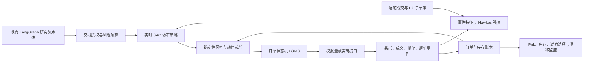

# 《Reinforcement Learning in Non-Markov Market-Making》精读总结

## 1. 论文信息

- 标题：Reinforcement Learning in Non-Markov Market-Making
- 作者：Luca Lalor、Anatoliy Swishchuk
- 主题：非 Markov 市场动态、最优做市、Soft Actor-Critic、Hawkes 过程、半 Markov 过程
- arXiv：2410.14504，q-fin.CP / q-fin.MF
- 版本：v1 于 2024-10-18 提交；本文下载的是 v2，修订于 2024-11-17
- 原文：https://arxiv.org/abs/2410.14504
- 本地 PDF：`2410.14504_reinforcement_learning_non_markov_market_making.pdf`
- PDF SHA-256：`A3071901FECEEEB0367764FDE6963EA4EDE5E9093FD1E26B3509A4E49C63EF57`

## 2. 一句话结论

论文证明了 SAC 可以在带库存约束、库存惩罚、Hawkes/半 Markov 参数和逆向成交的模拟做市环境中学到低库存策略；但实验仍是同分布模拟器上的概念验证，未建模真实订单簿队列、动态点差、延迟、手续费和市场冲击，也未充分解释非 Markov 历史如何进入策略状态，因此不能直接作为实盘盈利证据。

## 3. 研究问题

做市商在最优买卖报价附近持续挂限价单，赚取买卖价差，同时承担三类主要风险：

1. 库存风险：连续成交会累积方向性头寸，价格变化可能吞噬点差收益。
2. 逆向选择：限价单成交后，市场价格立刻朝不利方向移动。
3. 市场微观结构的非 Markov 性：订单到达存在聚集、自激和持续时间依赖，仅用算术布朗运动难以表达。

论文用 SAC 求解一个受库存约束的做市控制问题，并尝试用半 Markov和 Hawkes 跳跃扩散模型改善价格过程，用逆向/非逆向成交分类改善成交模拟。

## 4. 主要贡献

### 4.1 非 Markov 市场生成机制

论文从半 Markov 与 Hawkes 跳跃过程出发，构造价格过程的扩散近似：

$$
dP_t = \eta\,dt + \sqrt{\sigma^2 + \bar{\sigma}^2 + \varsigma^2}\,dW_t.
$$

其中漂移和波动系数可由半 Markov 或 Hawkes 模型的长期概率、转移概率、事件间隔、背景强度和激励核等参数推导。

- 半 Markov：状态停留时间可以服从一般分布，记忆主要通过当前状态及其停留时间表达。
- Hawkes：条件强度由历史事件激励，适合表达订单到达聚集和自激。
- 作者认为订单簿事件通常具有聚集与自激特征，因此 Hawkes 在很多 LOB 场景中更合适。

需要注意：训练时使用的是上述扩散近似。它把非 Markov 事件过程压缩为漂移和波动参数，未必保留原始 Hawkes 事件路径的全部历史依赖。

### 4.2 成交与逆向选择

论文将成交分成两类：

- 非逆向成交：在没有紧随其后的不利价格变化时，以概率 `p` 成交。
- 逆向成交：挂在最优买价后下一时刻买价下移，或挂在最优卖价后下一时刻卖价上移。

库存由买卖成交差决定：

$$
Q_t^A = N_t^{A,-} - N_t^{A,+}.
$$

现金过程为：

$$
dC_t^A = \left(P_t + \frac{\Delta}{2}\right)dN_t^{A,+}
- \left(P_t - \frac{\Delta}{2}\right)dN_t^{A,-}.
$$

这里 `Δ` 是固定买卖价差。财富为 `W_t^A = Q_t^A P_t + C_t^A`。

逆向成交是论文中最有工程价值的部分。实验清楚展示：忽略逆向成交会制造明显的“虚假收益”，加入逆向成交后回报显著降低。

## 5. SAC 设计

### 5.1 为什么选择 SAC

SAC 是离策略、最大熵 Actor-Critic 算法：

- Actor 产生随机策略，熵项鼓励探索。
- 两个 Critic 估计状态动作价值，取较保守估计以降低过估计偏差。
- Replay Buffer 允许复用历史转移。
- Target Network 通过软更新改善训练稳定性。

论文认为 SAC 比传统随机最优控制更容易扩展到高维、非线性状态动作空间。

### 5.2 状态

策略状态只有两个变量：

$$
S_t = (P_t, Q_t^A).
$$

- `P_t`：中间价，使用 z-score 标准化。
- `Q_t^A`：库存，使用 min-max 标准化。
- 库存范围：`Q_t^A ∈ {-q, ..., q}`。

### 5.3 动作

内部库存未触及边界时，动作集合为：

$$
A_t \in \{-1, 0, 1\}.
$$

含义是卖出/不操作/买入，或是否在最优买卖价挂单位数量限价单；触及 `-q` 或 `q` 时禁止继续扩大相应方向库存。

这个定义比真实做市动作简单很多：它没有同时控制双边报价距离、双边订单量、撤单、改价和订单有效期。

### 5.4 奖励

优化目标是最大化终端财富并惩罚持有库存：

$$
\mathbb{E}_{\pi}\left[W_T^A - \alpha\int_0^T |Q_t^A|dt\right].
$$

- `W_T^A`：期末财富。
- `α`：库存惩罚系数。
- 绝对库存积分：惩罚长时间持有非零头寸。

### 5.5 网络结构

- Actor：输入维度 2；两层 256 单元 ReLU；输出高斯分布均值和对数标准差。
- Critic：两个独立 Q 网络；输入为 `[state, action]`；每个网络两层 256 单元 ReLU；输出标量 Q 值。
- 论文还描述了一个“参数网络”，结构近似相同，但其输出如何与标准 SAC 参数化精确衔接没有充分说明。
- 实现使用 Python 与 Stable-Baselines3。

## 6. 实验设置

| 参数 | 数值 | 含义 |
| --- | ---: | --- |
| `dt` | 0.001 | 时间步长 |
| `T` | 1 | 单回合期限 |
| `P0` | 50 | 初始中间价 |
| `q` | 5 | 最大绝对库存 |
| `dQ` | ±1 | 每次库存变化 |
| `Δ` | 0.01 | 固定买卖价差 |
| `α` | 0.001 | 运行库存惩罚 |
| `p` | 0.2 | 非逆向成交概率 |
| `η` | 0 | 漂移参数 |
| `σ`、`barσ`、`ζ` | 0.1 | 波动相关参数 |
| 训练回合 | 1000 | 每回合约 1000 步，合计约 100 万步 |
| 测试回合 | 200 | 固定策略、未见回合 |

作者明确说明多数参数是为展示算法学习能力而选取，而不是从同一个真实市场完整校准得到。训练与测试使用同一种环境和同一组参数分布。

## 7. 实验结果解读

### 7.1 不考虑逆向成交

- 训练后大多数回合获得正的终端累计奖励。
- 测试 200 回合的终端奖励主要约为 `1.1` 至 `1.8`。
- 学到的策略通常把库存控制在 `-1` 到 `1`，减少尾部损失。

### 7.2 考虑逆向成交

- 训练奖励显著恶化，并出现很长的左尾。
- 测试结果虽比训练早期稳定，但终端奖励大多仍为负，图中大致分布在 `-0.8` 到接近 `0.1`。
- 这说明只要把做市商成交后的价格不利移动纳入环境，表面上的点差收益会大幅缩水。

### 7.3 可以得出的结论

- SAC 确实学会了库存控制行为。
- 库存惩罚和硬库存上限共同压低了风险敞口。
- 逆向成交是否建模，会决定回测结论是否过度乐观。

### 7.4 不能得出的结论

- 不能证明策略在真实市场盈利。
- 不能证明 Hawkes 一定优于半 Markov，因为实验没有给出充分的模型间对照、显著性检验或消融。
- 不能证明策略能跨市场状态泛化，因为测试环境与训练环境同分布。
- 不能证明 SAC 优于传统做市、PPO、DQN 或规则策略，因为没有基准策略对比。

## 8. 作者承认的局限

1. 交易围绕中间价模拟，并假设固定一跳点差；真实点差随波动和流动性变化。
2. 价格与订单到达之间的依赖只通过逆向成交近似，未建立完整离散订单簿事件系统。
3. 未追踪 price-time priority 下的真实队列位置，成交时点仍可能失真。
4. 扩散价格不是离散 tick 网格，可能产生现实中不可交易的价格，如 `50.007`。
5. 成交概率是固定值，真实成交概率应随队列、订单流、波动和市场状态变化。

作者建议后续引入完整或约化 LOB、动态点差、随机非逆向成交概率、随机波动率，并扩展到清算、建仓、统计套利、成交量不平衡和配对交易。

## 9. 进一步技术审查

以下问题不是对论文方向的否定，而是决定能否工程落地的关键缺口。

### 9.1 非 Markov 环境没有进入策略记忆

论文强调 Hawkes 强度依赖全部历史事件，但策略状态仅为 `(P_t, Q_t)`，没有包含：

- Hawkes 当前强度或激励衰减状态；
- 最近订单到达序列；
- 买卖方向事件计数；
- 距离上次事件的时间；
- 半 Markov 当前状态的年龄；
- 循环网络或 Transformer 的历史表示。

因此，对策略而言，环境更接近部分可观测决策过程。若最终训练价格过程又采用常系数扩散近似，原始非 Markov 记忆还会进一步被弱化。

### 9.2 动作空间描述存在接口歧义

动作被定义为离散 `{-1, 0, 1}`，Actor 却输出高斯均值和标准差。论文未说明如何把连续样本映射到离散动作，也未说明该映射对梯度和边界动作的影响。

工程实现必须二选一：

- 保持 SAC，将动作改成连续的 bid offset、ask offset 和双边 size；
- 保持离散动作，改用原生支持离散策略的算法，并明确掩码规则。

### 9.3 奖励与回测统计不足

- 论文给出终端优化目标，但每一步 reward 如何拆分没有完整实现细节。
- 未报告手续费、交易所返佣、滑点、延迟、撤单失败或市场冲击。
- 未给出 Sharpe、最大回撤、成交率、库存分布、尾部风险和置信区间。
- 未报告随机种子、重复训练方差及主要 SAC 超参数。
- 仅看累计奖励直方图，无法判断统计显著性和部署稳定性。

### 9.4 模拟到真实的差距

论文的实验最适合定义为 simulator proof-of-concept。尤其是考虑逆向成交的测试结果大多仍为负，不能用“不含逆向成交”的正收益图作为部署依据。

## 10. 对当前仓库的价值

当前仓库是日线级股票研究 LangGraph：`MarketDataProvider.fetch()` 获取区间 OHLCV 与估值，行业、个股和市场节点汇总后由 `decision_agent` 输出买入、持有、观望、减仓或卖出倾向。它不是逐事件订单执行系统。

因此，这篇论文不应直接替换现有 `decision_agent`，而应补充一个独立的实时执行/做市子系统。研究图负责产生标的、方向和风险预算；实时子系统负责订单簿状态、报价、订单生命周期、库存与停机保护。

### 10.1 最值得吸收的三个设计

1. 逆向成交标签：把成交后短窗口价格不利移动作为独立风险指标，避免只统计点差捕获。
2. 库存约束双保险：策略 reward 中加入库存成本，同时在策略外保留不可绕过的硬上限。
3. 事件聚集状态：将 Hawkes 强度或订单流历史编码加入实时状态，捕捉订单到达聚集和流动性状态变化。

### 10.2 建议架构



### 10.3 推荐新增模块边界

不要把毫秒级循环作为 LangGraph 普通节点反复调度。LangGraph 适合研究编排、策略部署审批、异常处理和复盘；实时控制环应由常驻事件循环承担。

- `realtime/events.py`：标准化 quote、trade、order、fill、cancel、reject 事件。
- `realtime/order_book.py`：维护 L2 快照、增量更新、序列号与恢复。
- `realtime/features.py`：spread、microprice、imbalance、order-flow imbalance、Hawkes intensity。
- `realtime/environment.py`：离散 tick、队列位置、部分成交、延迟、手续费与返佣模拟。
- `realtime/policies/sac_market_maker.py`：只负责策略推理，不直接调用券商。
- `realtime/risk.py`：库存、订单数、单笔量、亏损、行情陈旧、模型超时和 kill switch。
- `realtime/oms.py`：订单幂等、client order id、状态转换、撤单与对账。
- `realtime/replay.py`：同一事件流支持训练、回测和故障复现。

### 10.4 建议状态

论文的二元状态应扩展为：

```text
midprice, spread, best_bid_size, best_ask_size,
microprice, order_book_imbalance, order_flow_imbalance,
hawkes_buy_intensity, hawkes_sell_intensity,
inventory, cash, realized_pnl, unrealized_pnl,
bid_queue_position, ask_queue_position,
live_bid_order, live_ask_order,
short_horizon_volatility, latency, feed_age,
remaining_risk_budget, seconds_to_session_end
```

如果不显式估计 Hawkes 强度，则至少使用最近 `N` 个事件的 GRU/Transformer 编码，使策略有能力恢复非 Markov 历史。

### 10.5 建议动作

为了与连续 SAC 一致，动作建议改为：

```text
bid_offset_ticks, ask_offset_ticks,
bid_size, ask_size,
cancel_bid_probability, cancel_ask_probability
```

经过动作裁剪、tick 对齐和库存风控后再交给 OMS。若只保留挂买、等待、挂卖三个动作，则应选择离散策略算法并实现 action mask。

### 10.6 建议奖励

使用逐事件增量奖励，避免只有期末财富：

$$
r_t = \Delta W_t
- \lambda_q |Q_t|\Delta t
- \lambda_{adv} AdvFill_t
- Fees_t
- \lambda_{dd}\Delta Drawdown_t
- \lambda_{msg} MessageCost_t.
$$

- `ΔW_t`：盯市财富增量。
- `AdvFill_t`：成交后短窗口的不利价格移动。
- `Fees_t`：手续费减返佣。
- `Drawdown`：回撤增量。
- `MessageCost`：撤改单与消息频率成本。

硬风控不能只体现在 reward 中。无论策略输出什么，风险层都必须拒绝越过库存、亏损、频率和行情新鲜度上限的动作。

### 10.7 建议新增数据库表

```sql
market_events(
  event_id, venue, symbol, exchange_ts, receive_ts,
  sequence_no, event_type, side, price, size, payload_json
)

order_book_snapshots(
  snapshot_id, symbol, event_id, best_bid, best_ask,
  bid_levels_json, ask_levels_json, spread, microprice
)

policy_actions(
  action_id, model_run_id, event_id, state_json,
  raw_action_json, clipped_action_json, inference_us
)

orders(
  order_id, client_order_id, action_id, side, price, size,
  status, submitted_at, acknowledged_at, cancelled_at, reject_reason
)

fills(
  fill_id, order_id, event_id, price, size, fee, rebate,
  queue_time_us, adverse_move_10ms, adverse_move_100ms, adverse_move_1s
)

inventory_snapshots(
  snapshot_id, symbol, event_id, position, cash,
  realized_pnl, unrealized_pnl, gross_exposure
)

rl_model_runs(
  model_run_id, algorithm, environment_version, feature_version,
  reward_version, seed, hyperparameters_json, artifact_uri, status
)

risk_events(
  risk_event_id, event_id, rule_name, severity,
  observed_value, limit_value, action_taken
)
```

## 11. 分阶段实现建议

### 阶段 1：可复现事件回放

- 建立统一事件格式、订单状态机和不可变账本。
- 使用历史 L2/逐笔数据重放，不接真实券商。
- 实现固定规则做市基线和完整费用模型。
- 指标至少包含净 PnL、Sharpe、最大回撤、库存尾部、成交率、撤单率和逆向选择成本。

验收标准：相同事件流和随机种子得到完全一致的订单、成交与 PnL。

### 阶段 2：非 Markov 状态与仿真器

- 估计买卖事件 Hawkes 强度，或训练历史序列编码器。
- 仿真器支持动态点差、离散 tick、队列位置、部分成交和延迟。
- 对比 Brownian、半 Markov、Hawkes 和经验重放四类环境。

验收标准：模拟数据在到达间隔、自相关、成交率、spread、queue depletion 和价格响应上接近真实数据。

### 阶段 3：策略训练和严格基准

- 连续报价动作使用 SAC；离散动作使用相匹配的算法。
- 基线至少包括 inventory-skewed rule、Avellaneda-Stoikov 和无历史特征策略。
- 做多随机种子、walk-forward、跨波动状态与参数压力测试。
- 报告均值、置信区间、尾部损失和换手后净收益。

验收标准：策略在未见市场日期和压力情景下，风险调整后收益稳定优于基线，而不是只在同分布模拟器中胜出。

### 阶段 4：模拟盘与影子模式

- 策略先只产生报价建议，不发单。
- 对比建议成交与真实可成交结果，校准队列和延迟模型。
- 再进入限额模拟盘，所有动作通过确定性风险网关。

验收标准：行情断流、订单拒绝、重复事件、时钟漂移和模型超时均能触发降级或停机。

## 12. 最终评价

这篇论文对当前仓库的最大价值不是“增加一个 SAC 节点”，而是提供了实时执行子系统的三个设计原则：把逆向选择显式计入收益、把库存作为核心状态和风险约束、让订单流历史进入市场状态。

直接复现论文只能得到教学级模拟做市器。要达到可测试的工程系统，优先级应是：事件回放与账本 > 订单簿/队列仿真 > 硬风控 > 可靠基线 > 非 Markov 特征 > SAC 策略。实时基础设施和验证框架未完成前，不应连接真实资金。
