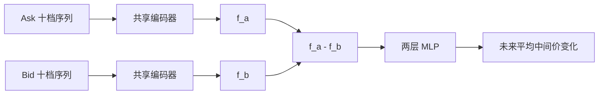
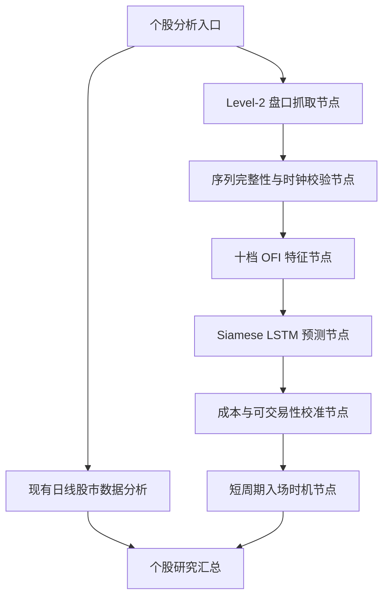

# 《An Efficient Deep Learning Model to Predict Stock Price Movement Based on Limit Order Book》精读总结

## 1. 论文信息

- 标题：An Efficient Deep Learning Model to Predict Stock Price Movement Based on Limit Order Book
- 作者：Jiahao Yang、Ran Fang、Ming Zhang、Jun Zhou
- 机构：中国科学院声学研究所、中国科学院大学
- arXiv：2505.22678，q-fin.TR / cs.LG
- 版本：v1，2025-05-14
- 原文：https://arxiv.org/abs/2505.22678
- 本地 PDF：`2505.22678_efficient_deep_learning_lob_stock_movement.pdf`
- PDF SHA-256：`C73CADB4CE7A29F08CB886419E3A70E523ADAB54C039F0D1D26D9BD1A937704E`

## 2. 一句话结论

论文最有价值的贡献不是提出一个全新的预测器，而是给现有 LOB 模型加入正确的结构先验：买盘和卖盘由共享参数的两个编码分支分别处理，再用两侧表示之差预测未来中间价变化；在 14 只中国 A 股的滚动测试中，这种 Siamese 结构和 OFI 特征普遍优于直接输入原始盘口，但实验只覆盖约四个月、单一行业和 3 秒快照，没有交易成本与盈利回测，因而适合作为短周期微观结构信号模块，不能直接替代当前仓库的基本面和日线决策。

## 3. 论文实际解决的任务

虽然标题使用“Stock Price Movement”，论文实际做的是回归，而不是上涨、平盘、下跌分类。

给定最近 50 个 Level-2 盘口快照，模型预测未来 `h` 个 tick 的平均中间价与当前中间价之差：

$$
r_k = \frac{1}{h}\sum_{t=k+1}^{k+h}\frac{a_t^1+b_t^1}{2}
- \frac{a_k^1+b_k^1}{2}.
$$

- `a_t^1`：时刻 `t` 的最优卖价。
- `b_t^1`：时刻 `t` 的最优买价。
- `h ∈ {10, 20, 50}`。
- 盘口每 3 秒更新，因此对应约 30 秒、60 秒和 150 秒。
- 标签被裁剪到 `[-1, 1]` CNY。

模型预测的是未来一段时间平均中间价变化，不是未来最后一个 tick 的收益，也不是可直接成交的买卖价收益。

## 4. A 股数据集

### 4.1 数据范围

- 数据类型：交易所 Level-2 十档盘口快照。
- 更新频率：约每 3 秒一次。
- 每日快照数：约 4500 至 5000。
- 日期：2021-01-06 至 2021-05-13。
- 股票数量：14。
- 行业范围：军工相关、流动性较好的 A 股。

股票代码：

```text
003026.SZ, 300864.SZ, 300870.SZ, 300877.SZ, 300881.SZ,
300886.SZ, 300892.SZ, 300896.SZ, 300898.SZ, 300908.SZ,
300910.SZ, 300919.SZ, 300925.SZ, 300999.SZ
```

数据不随论文公开下载。作者在 Data Availability 中说明，可向通讯作者合理申请。

### 4.2 滚动切分

每个滚动周期包含：

1. 第一周：验证集。
2. 随后五周：训练集。
3. 最后一周：样本外测试集。

14 只股票各形成 10 或 11 个测试窗口，总计 `N=149` 个测试集。

这种切分避免了随机打乱造成的直接未来泄漏，但有两个注意点：

- 验证周在训练周之前，虽然仍属于可获得的历史数据，但不是通常的“训练后验证”顺序。
- 论文没有充分说明每个滚动周期是否从头训练、是否暖启动，以及超参数网格搜索如何避免跨窗口反复利用测试结果。

## 5. 输入特征

### 5.1 原始 LOB

每个时刻使用十档买卖价和对应挂单量：

$$
s_{i,j}^{LOB} = (a^1,v^{1,a},b^1,v^{1,b},...,a^{10},v^{10,a},b^{10},v^{10,b})^\top
\in \mathbb{R}^{40}.
$$

最近 50 个 tick 组成一个 `50 × 40` 输入，即约 150 秒历史。

为了缓解隔夜跳空造成的价格分布漂移，作者从当天价格字段中减去前一交易日收盘价。论文没有同等详细地说明数量字段的缩放方法。

### 5.2 OFI

作者没有把 OFI 压缩成单个标量，而是为十档买盘和十档卖盘分别计算订单流向量。

对第 `i` 档买盘：

$$
bOF_{t,i}=\begin{cases}
v_{t}^{i,b}, & b_t^i>b_{t-1}^i \\
v_t^{i,b}-v_{t-1}^{i,b}, & b_t^i=b_{t-1}^i \\
-v_t^{i,b}, & b_t^i<b_{t-1}^i
\end{cases}
$$

对第 `i` 档卖盘：

$$
aOF_{t,i}=\begin{cases}
-v_t^{i,a}, & a_t^i>a_{t-1}^i \\
v_t^{i,a}-v_{t-1}^{i,a}, & a_t^i=a_{t-1}^i \\
v_t^{i,a}, & a_t^i<a_{t-1}^i
\end{cases}
$$

最终特征为：

$$
s_t^{OFI}=(bOF_t,aOF_t)^\top\in\mathbb{R}^{20}.
$$

最近 50 个 tick 形成 `50 × 20` 输入。

OFI 的优势在于将非平稳的绝对价格和数量状态转换为相邻盘口变化，更直接表达订单新增、撤销、成交以及供需变化。

## 6. Siamese 结构

### 6.1 核心思想

传统模型把买卖两侧拼在一起交给一个编码器。论文改为：

1. 将 ask 和 bid 输入分开。
2. 两个分支使用完全相同的编码器结构。
3. 两个编码器共享全部参数。
4. 得到卖盘表示 `f_t^a` 和买盘表示 `f_t^b`。
5. 用两者之差 `f_t^a-f_t^b` 作为预测解码器输入。



共享权重是一种结构约束：买盘和卖盘采用相同的特征提取规则，避免模型为两侧学习两套无关表示；做差则显式表达供需方向。

### 6.2 输出层

论文使用两层 MLP，并通过 sigmoid 将输出约束到标签范围：

$$
\hat y_t = \sigma(W_o^2(W_o^1(f_t^a-f_t^b)+b_o^1)+b_o^2)\times\hat\alpha-\hat\beta.
$$

`α̂` 和 `β̂` 用于将 sigmoid 输出映射到实际价格变化范围，但论文没有详细给出它们在每个窗口中的估计方法。

### 6.3 “高效”的真实含义

共享参数确实可以减少可训练参数并增加结构正则化，但两侧仍需要分别执行编码计算。论文没有报告：

- 参数量对比；
- FLOPs；
- 单批训练时间；
- 单样本推理延迟；
- 显存占用。

因此“efficient”主要是结构和参数效率主张，并未被系统性能指标充分验证。

## 7. 基线模型与训练

### 7.1 五类模型

| 模型 | 结构 |
| --- | --- |
| MLP | 2000/1000 维输入，三层隐藏层 500、250、64 |
| LSTM | 三层 stacked LSTM，隐藏维度均为 64 |
| MLP-LSTM | 先用 128 单元 MLP 映射到 64 维，再进入 LSTM |
| CNN-LSTM | 使用 1、3、5、7 卷积核的 inception 模块，再进入 LSTM |
| LSTM-MHA | 两层 LSTM 加四头注意力，隐藏维度 64 |

论文还试验了四层 causal 和 non-causal Transformer，但结果落后，因此未纳入主实验。作者推测原因是数据不足，以及标准 Transformer 不适合连续 LOB 序列；这个解释没有进一步消融验证。

### 7.2 训练参数

- 框架：PyTorch。
- 优化器：Adam。
- 学习率：`1e-4`。
- weight decay：`0.001`。
- batch size：`256`。
- early stopping：验证 MAE 连续 5 个 epoch 不下降则停止。
- LSTM 隐藏维度：`64`。
- MHA 头数：`4`。
- 训练目标：MAE。
- 硬件：Tesla P100 12 GB、Intel Xeon E5-2680 v4、128 GB RAM。

论文没有报告随机种子、重复训练次数、训练方差和最终 epoch 数。

## 8. 实验结果

### 8.1 总体排名

每个股票、测试窗口和预测 horizon 上，作者将 20 个“模型 × 输入 × 结构”组合按 MSE 排名，然后计算平均倒数排名：

$$
Score_{md}^h=\frac{1}{N}\sum_{k=1}^{N}\frac{1}{rank_{md}^{k,h}}, \quad N=149.
$$

主要排名：

| Horizon | 第一名 | 第二名 | 第三名 |
| --- | --- | --- | --- |
| 10 tick | OFI + Siamese + LSTM-MHA | OFI + Siamese + MLP-LSTM | OFI + Siamese + LSTM |
| 20 tick | OFI + Siamese + LSTM-MHA | OFI + Siamese + LSTM | OFI + Siamese + MLP-LSTM |
| 50 tick | OFI + Siamese + LSTM | OFI + Siamese + LSTM-MHA | OFI + Original + LSTM |

结论是短窗口内 MHA 更有帮助，长窗口则普通 LSTM 更稳定。

### 8.2 OFI 与原始 LOB

除 MLP 外，OFI 在五种模型、三种 horizon 和原始/Siamese 两种结构中几乎全面优于原始 LOB。

例子：

- 10 tick、原始 LSTM：OFI 在 149 个测试集中的 146 个胜出，LOB 仅 3 个。
- 20 tick、Siamese MLP-LSTM：OFI 148 个胜出，LOB 1 个。
- 50 tick、原始 LSTM-MHA：OFI 147 个胜出，LOB 2 个。

MLP 是明显例外，说明 OFI 需要序列模型才能充分利用。

### 8.3 Siamese 与原始结构

根据表 3，排除 MLP 后：

- 共 `4 个模型 × 2 类输入 × 3 个 horizon = 24` 组配对。
- Siamese 在其中 23 组胜出。
- 唯一明确失败是 50 tick、原始 LOB 输入下的 LSTM-MHA：原始结构在 80 个测试集胜出，Siamese 在 60 个胜出。

包括 MLP 时，Siamese 仍在 30 组配对中的 26 组胜出；MLP + OFI 在三个 horizon 上都没有受益。

### 8.4 绝对预测能力

相对排名改善不代表预测能力很强：

- 10 tick 时，非 MLP 模型的样本外 `R²` 多数只是略高于零。
- 随 horizon 增加，`R²` 明显下降。
- 50 tick 时多个组合的 `R²` 为负。
- MLP 的 `R²` 极差，在图中达到大幅负值。

这意味着模型只解释了价格变化中的很小部分，高噪声仍占主导。

### 8.5 波动与误差

作者使用测试标签的平均绝对变化和标准差衡量波动，发现：

- 波动与 MAE 呈很强的正相关。
- 波动与 `R²` 仅呈较弱正相关。
- 越剧烈的价格变化带来越大的绝对误差，模型可解释部分仍有限。

## 9. 论文值得肯定的地方

1. 数据来自中国 A 股，而不是继续只在 FI-2010 或 Nasdaq 数据集上验证。
2. 使用滚动时间窗口，而不是随机拆分高相关的盘口样本。
3. 同时比较原始 LOB 和 OFI，证明特征设计往往比盲目增加网络复杂度更重要。
4. Siamese 是可插拔结构，可以加到 MLP、LSTM、CNN-LSTM 和注意力模型。
5. 使用 149 个股票-时间窗口报告胜出次数，比只报告一次聚合均值更有解释力。
6. 结果诚实地展示了 MLP、CNN 和 MHA 的失败场景，并非所有复杂模型都更好。

## 10. 局限与技术审查

### 10.1 样本覆盖窄

- 只有 14 只军工相关股票。
- 只有 2021 年 1 月至 5 月约四个月。
- 股票多集中于相似市场板块和上市阶段。
- 没有跨行业、跨年度、牛熊市、极端波动或低流动性验证。

因此不能证明结构对整个 A 股市场稳定有效。

### 10.2 数据不可直接复现

数据需要向作者申请，论文没有附公开数据集或完整生成脚本。即使模型结构清楚，当前也无法仅凭论文复现实验数值。

### 10.3 标签不是可成交收益

目标是未来平均中间价变化，未考虑：

- 买入使用 ask、卖出使用 bid；
- spread；
- 手续费和滑点；
- 排队与成交概率；
- 延迟；
- 冲击成本；
- 无法按预测价格成交的情况。

论文也明确承认没有将预测转化为盈利策略。

### 10.4 固定 1 CNY 裁剪不是尺度无关的

不同价格水平股票使用相同的 `±1 CNY` 标签上限，其经济含义不同。更稳健的方法是使用：

- basis points；
- tick 数；
- 波动率标准化收益；
- spread 标准化收益。

裁剪还会弱化模型对真正跳跃风险的学习。

### 10.5 指标公式和基准存在疑点

- 论文公式中的 MAE 和 MSE 没有写 `1/N`，与“mean”定义不一致，可能是排版错误。
- `R²_OS` 的基准看起来使用测试集标签均值，而不是训练期可获得的历史均值。这不会把未来信息输入模型，但会使该基准不能作为实时可部署预测器。
- 论文主要报告相对排名与胜出次数，没有配对显著性检验或置信区间。

### 10.6 高度重叠标签

每 3 秒产生一个样本，而标签覆盖未来 10、20 或 50 tick。相邻样本的预测区间大量重叠，因此样本级误差并不独立。滚动周测试缓解了训练测试泄漏，但不能把每个 tick 当成独立统计证据。

### 10.7 对称并非完全等价

买卖盘在数据结构上对称，但市场行为可能存在方向不对称。强制共享参数可能漏掉只出现在单侧的行为模式。建议保留：

- 共享主干；
- 少量 side-specific adapter；
- 对称差分特征；
- 非对称残差分支。

### 10.8 “高效”缺少运行指标

论文没有参数量、速度和内存对比，因此只能确认参数共享带来的结构效率，不能确认生产推理延迟更低。

## 11. 与上一篇非 Markov 做市论文的关系

两篇论文关注点互补：

| 论文 | 主要问题 | 可供当前项目使用的部分 |
| --- | --- | --- |
| Non-Markov Market-Making | 如何在非 Markov 环境下控制做市库存与挂单 | 逆向成交、库存惩罚、Hawkes 事件状态、执行风控 |
| Siamese LOB Prediction | 如何从买卖十档盘口预测短期中间价 | OFI、买卖盘共享编码、30-150 秒价格变化信号 |

合理组合方式是：Siamese OFI 模型提供短周期价格/订单流预测，做市或执行策略将预测作为状态输入，再由库存与成交风险模型决定是否挂单。预测模型本身不能直接负责下单。

## 12. 对当前仓库的改进价值

### 12.1 适用位置

当前仓库使用日线 OHLCV、估值、基本面、行业和市场信息生成研究报告。论文信号只覆盖约 30 至 150 秒，因此最适合作为：

- 短线模式下的入场时机证据；
- 盘口买卖压力指标；
- 流动性和逆向选择风险指标；
- 未来执行模块的输入；
- 不适合作为中长期行业或公司价值判断。

### 12.2 推荐新增分支



每个节点仍应分别放在 `agents/` 中，模型训练与特征数学实现放在独立 `analysis/` 或 `models/` 模块，Agent 只负责调用、校验和写入 State。

### 12.3 建议 State 字段

```python
lob_market_data: dict
lob_data_quality: dict
ofi_features: dict
lob_forecast_result: dict
lob_tradeability_result: dict
entry_timing_result: dict
```

`lob_forecast_result` 至少包含：

```text
model_version, feature_version, as_of_exchange_ts,
horizon_ticks, horizon_seconds,
predicted_midprice_change_bps,
predicted_ticks, prediction_uncertainty,
spread_bps, data_age_ms, model_latency_ms,
training_universe, validation_period,
out_of_distribution_score
```

### 12.4 Provider 边界

现有 `MarketDataProvider.fetch()` 是日线区间接口，不能承载 Level-2 事件。应新建协议，而不是扩展原接口为不稳定的大字典：

```python
class LimitOrderBookProvider(Protocol):
    def snapshot(self, ticker: str, depth: int = 10) -> dict: ...
    def history(self, ticker: str, end_time: str, ticks: int) -> list[dict]: ...
    def stream(self, ticker: str): ...
```

实时流还需要 sequence number、exchange timestamp、receive timestamp、快照恢复和缺口检测。

### 12.5 决策融合规则

不应直接把预测值加到当前基本面总分。建议：

1. 仅当 `investment_horizon == "short"` 时启用 LOB 分支。
2. 中长期报告只把它列为流动性与短线技术附加信息。
3. 数据延迟、序列缺口或 OOD 分数过高时，信号强制失效。
4. 预测变化必须先减去 spread、费用和滑点阈值。
5. 只有多个 horizon 方向一致且不确定性较低时，才改变入场时机。
6. 不允许盘口预测推翻证据充分的基本面风险结论。

### 12.6 建议数据库表

```sql
lob_snapshots(
  id, ticker, exchange_ts, receive_ts, sequence_no,
  bid_levels_json, ask_levels_json, source, created_at
)

lob_ofi_features(
  id, ticker, exchange_ts, depth,
  bid_ofi_json, ask_ofi_json, aggregate_ofi,
  feature_version, source_snapshot_id, created_at
)

lob_model_predictions(
  id, run_id, ticker, exchange_ts, model_version,
  horizon_ticks, horizon_seconds,
  predicted_change_bps, predicted_ticks,
  uncertainty, spread_bps, inference_ms,
  state_json, created_at
)

lob_model_evaluations(
  id, model_version, ticker, test_start, test_end,
  horizon_ticks, mae, mse, r2_oos,
  directional_accuracy, net_return_after_cost,
  max_drawdown, turnover, evaluation_json
)
```

## 13. 推荐实现顺序

### 阶段 1：离线特征验证

- 获取合法的 A 股 Level-2 历史数据。
- 实现十档 LOB 与 OFI，建立逐日不可变特征文件。
- 校验盘口排序、重复快照、缺失序列、午间断点和跨日边界。
- 先用线性 OFI、LightGBM 和普通 LSTM 建立基线。

### 阶段 2：Siamese 消融

- 对比原始联合编码、完全共享 Siamese、非共享双分支和共享主干加单侧 adapter。
- 标签同时测试 CNY、tick、bps 和波动率标准化形式。
- 使用 purged walk-forward，避免重叠标签污染窗口边界。
- 报告多随机种子、置信区间、参数量和推理延迟。

### 阶段 3：可交易性评估

- 将中间价预测转换为 bid/ask 可成交收益。
- 加入 spread、手续费、滑点、延迟和成交概率。
- 与零预测、OFI 线性模型和简单 imbalance 规则比较。
- 评估净收益、换手、最大回撤、容量和信号衰减。

### 阶段 4：接入研究图

- 只输出标准化的短周期证据，不直接下单。
- 由 Reflection 校验数据时效、覆盖率、模型版本和成本后收益。
- 报告中明确区分研究结论、盘口预测和执行时机。

## 14. 最终评价

相较于使用更深、更大的通用网络，这篇论文更值得当前项目吸收的是“让模型结构服从金融数据结构”：买卖盘共享编码表达对称性，OFI 表达状态变化，而不是直接让模型从绝对十档价格和数量中自行发现一切。

它与当前股票研究方向确实更贴近，但贴近的是 A 股短周期微观结构，而不是行业、盈利和估值研究。最稳妥的落地方式是新增一个可选的 LOB 时机分支，并把输出限制为短线证据和执行输入。在获得可复现 Level-2 数据、完成成本回测和跨年度验证之前，不应提高最终买卖结论的置信度。
